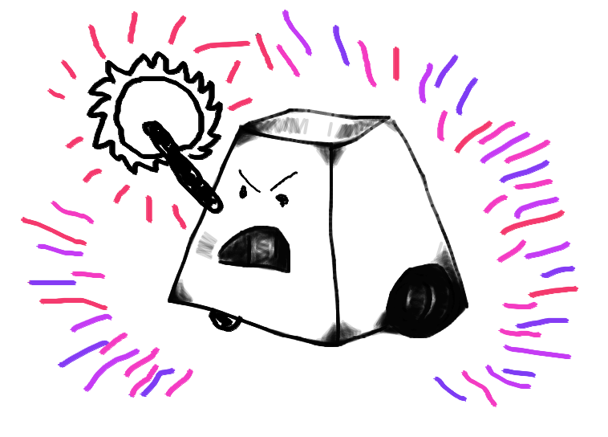

# X - 2022
Creación de un bot de pelea a través del proyecto "Battlebots: Mi primera máquina de pelea"

## Integrantes
- Tamara Aracena - FCFM
- Martín Molina - FCFM
- Fernando Soto - FCFM

## Descripción del proyecto

### Estrategia utilizada
#### Ofensiva
Con el fin de vencer a sus contrincantes, X-bot posee un disco giratorio vertical de aluminio en su parte frontal y a una altura minima para que no toque el suelo. Este disco alcanza velocidades muy altas para así inflingir el mayor daño posible al momento del contacto. 
Su forma está diseñada con el fin de enganchar de alguna manera la base de su contrincante y poder volcarlo.

#### Defensiva
Tiene una defensa impenetrable de acero inoxidable puesta en forma de caparazon para que asi pueda soportar golpes en la parte superior de gran magnitud

### Diagrama funcional
<Diagrama general de funcionamiento. Se sugiere un esquema de sistemas, completo.>

### *BONUS*: Paso a Paso
Se escoge una base de 2 a 4 motores con ruedas con un arduino
Usar los codigos y un modulo bluetooth para moverlo
Se conecta con la aplicacion APK en un celular para moverlo a voluntad
Con la ayuda de unos pilares de afirma el motor para el ataque y el caparazón de acero inoxidable 
Listo para destrozar a los demás battlebots
## Licencia
 Esta obra está bajo una <a rel="license" href="http://creativecommons.org/licenses/by-nc/4.0/">Licencia Creative Commons Atribución-NoComercial 4.0 Internacional</a>.
